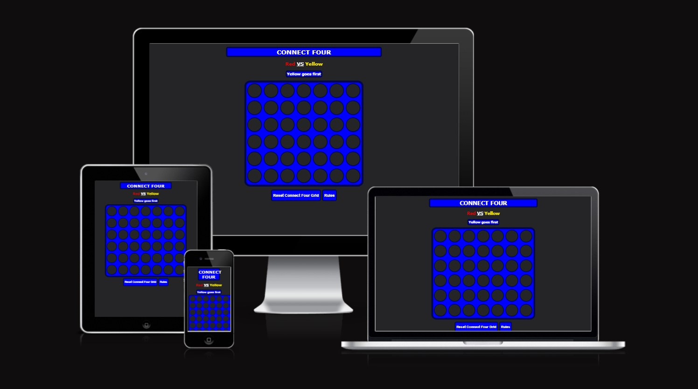
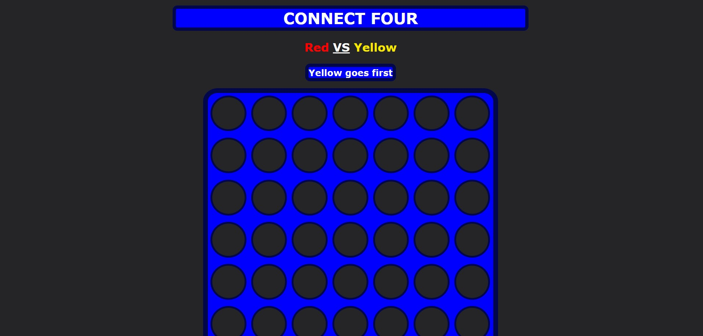
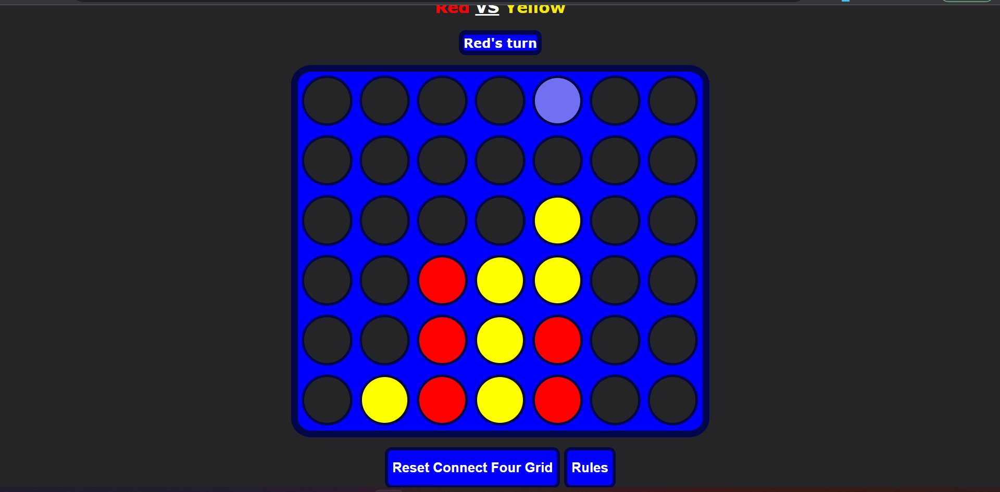
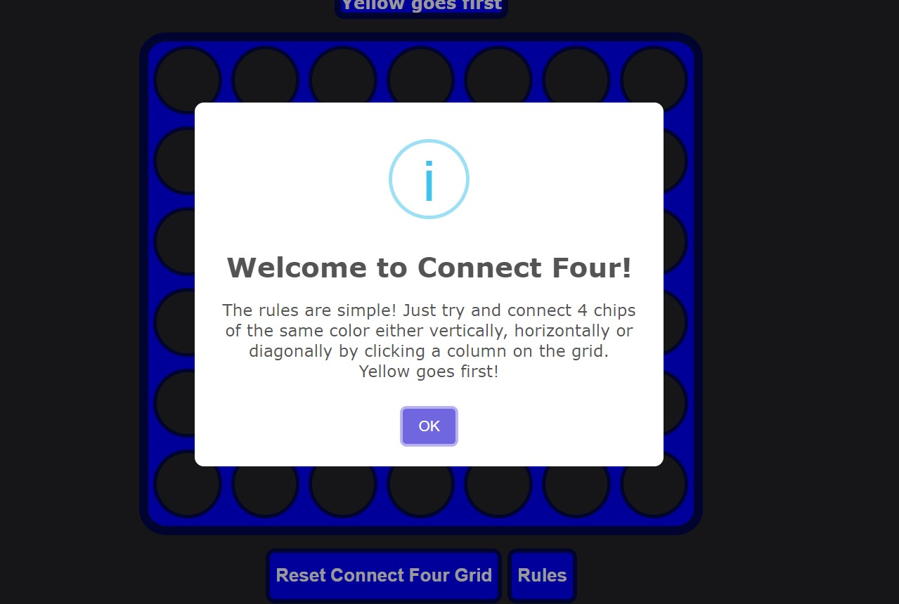
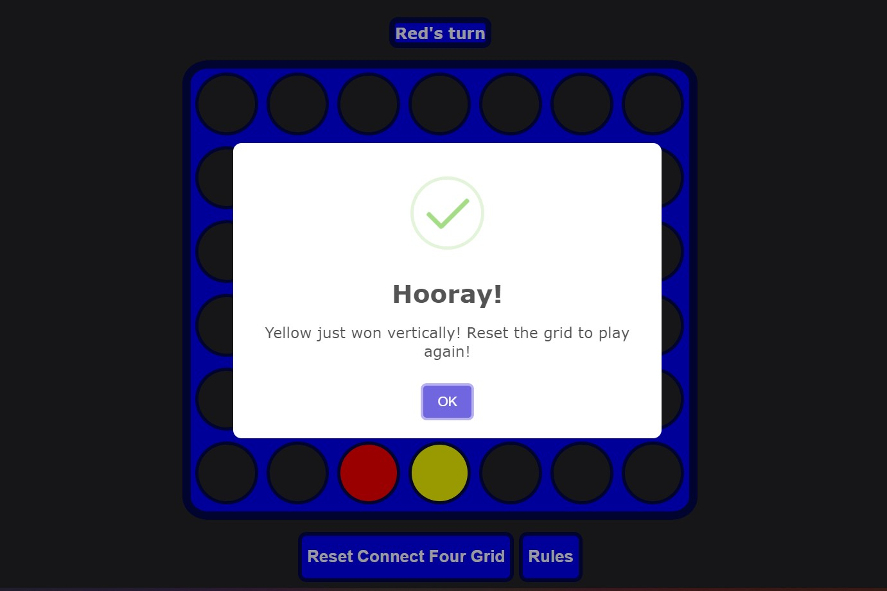
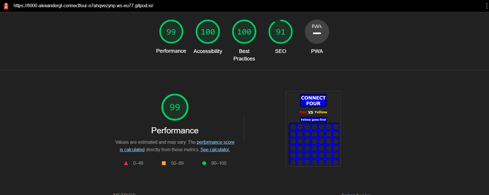

# Connect Four
[Try the game here!](https://alexanderglemme.github.io/connectFour/)

[Visit repository here!](https://github.com/alexanderglemme/connectFour)

## Brief description of the game
Connect four is a classic two player game that most people remember even from childhood. It's quite simple and easy to get started. The game consists of a grid and two sets of yellow and red chips, that each player has to try and connect in a sequence of four either vertically, horizontally or diagonally. The player who first successfully does so wins the game.

# Features

## Top
The styling to the page is very simple and intuitive. The top of page therefore only consist of the title of the game, who's playing who, and a turn indicator that changes text content to indicate who goes first, and after the first chip has been placed who's turn it is.

## Grid
The grid places a chip at the lowest point of the clicked column, as would in a real connect four board game. The cells also feauture a hover effect that helps the user know which column he/she is about to click.

While playing the game on a touch screen, the cell's hover effect persists after the click. Which reminds the user in which column the users opponent latest placed a chip. 

## Buttons
Underneath the grid is situated two buttons.
1. The reset button, which resets the grid to it's initial state and lets the users play again.
2. The rules button, which when clicked shows a sweetalert2 pop up containing the rules which can be helpful for any first time users.
They both feature a color and cursor change while hovered with mouse.

## Winner message
When a player wins, a sweetalert2 pop up will appear telling the user who won, how he/she won and how to play again like so:

!(assets/images/)
!(assets/images/)

# Testing
- The game has been tested and works in Safari, Chrome and Edge.
- The HTML source code passes through the Wc3 validator without any warnings or errors, the same goes for the CSS in the Jigsaw validator and for the JavaScript in the JSHint validator.
- The sites lighthouse score is 100 on all assessments except on performance (99) and on Search Engine Optimaization (91). The low SEO score is a function of not having aria-labels on any of the JS generated divs.

# Unfixed bugs
There are no unfixed bugs that I am aware of at this point in time.

# Deployment
- The site was deployed to Github pages via the repository settings like this: 
- First go to the repository, then click 'settings', then scroll down and go to the 'pages' section.
- From there just specify what and from where you want to deploy, and click deploy.

# Credits

### Sweet Alerts
- All code or file that is named sweetalert2 concerns the in game pop-ups and is directly taken from [sweetalert2](https://sweetalert2.github.io/#examples) which is a free, open source package that effectively replaces JSs vastly inferior alert() pop-ups. Using sweetalerts2 keeps the styling of the pop-ups consistent over all browsers and opperative systems, and they look nicer.

### Code
- I've at times turned to w3schools.com and stackoverflow to get explanations about syntax and what it does and how to use it, and sometimes copied syntax from there but then applied it in my own way.

- Before I started to code I watched [this tutorial](https://www.youtube.com/watch?v=4ARsthVnCTg&t=809s) from the youtube channel 'Kenny Yip Coding' which gave me inspiration and a general idea of what and how to code the game. Though nothing is directly copy/pasted, since it's my first time coding in JS, this video has definetly influenced my code and structure of this project.

- My mentor Brian Macharia has been a huge resource throughout the project.

### Minor disclaimers
#### Regarding my file structure
While creating this README something happened to my browser workspace that doesn't allow me to push the latest commits. This forced me to add all images via the repository through github leading me to just dumping the readme images in the assets folder. This does not however affect the actual performance of the game in any way.
#### regarding my github commits
1. The commits where large chunks of code appear to have been pasted in are chunks that I have written in the devtools and then pasted back into the source code. I am new to coding and don't know if this is standard proceedure or not.
2. The commits and commit messages can sometimes seem unclear, sometimes insufficient and sometimes over encumbered with actions. This is a result of me tinkering in the source code instead of in the devtools, resulting in many small saves and changes. Forgive me for any inconvenience regarding this.
